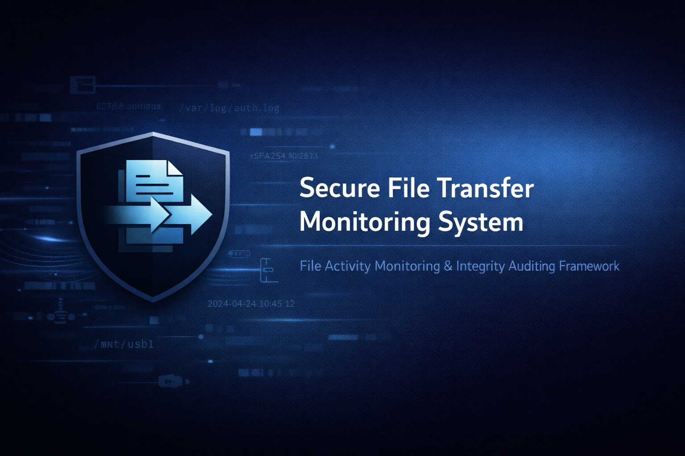

# Secure File Transfer Monitoring System



**Version:** 1.0.0  
**Status:** Active Development  
**License:** Educational / Internship Use Only

---

## 📌 Project Overview

The **Secure File Transfer Monitoring System** is a Python-based defensive cybersecurity tool designed to monitor file activity within a defined directory.

The system detects file creation, modification, deletion, and movement events. It identifies potentially sensitive files, calculates SHA-256 hashes for integrity verification, generates security alerts, records events in structured JSON logs, and produces an audit report.

The project demonstrates concepts commonly used in **Security Operations Centers (SOC)** and **Data Loss Prevention (DLP)** systems.

> This project is designed for monitoring and detection. It does not block, delete, or modify user files.

---

## 🎯 Objectives

- Monitor file-system activity in real time.
- Identify potentially sensitive files.
- Detect sensitive file activity in unauthorized locations.
- Verify file integrity using SHA-256 hashing.
- Record security events in structured logs.
- Generate an audit report after monitoring ends.
- Demonstrate practical defensive cybersecurity concepts.

---

## ✨ Features

### 🔍 Real-Time File Monitoring

The system uses `watchdog` to monitor file-system activity such as:

- File creation
- File modification
- File deletion
- File movement

### 🔐 Sensitive File Detection

Files can be classified as sensitive based on their file extension or filename.

**Sensitive extensions:**

- `.pdf`
- `.docx`
- `.xlsx`
- `.key`
- `.pem`
- `.sqlite`

**Sensitive keywords:**

- `confidential`
- `secret`
- `password`
- `budget`
- `salary`

### 🚨 Unauthorized Location Monitoring

The project uses two monitoring areas:

```text
secure_docs/
external_usb/

The `secure_docs` directory represents an authorized secure location, while `external_usb` is used to simulate an external or unauthorized storage location.

Sensitive file activity in the simulated external location can generate a security alert.

### 🔑 SHA-256 Integrity Verification

The system calculates a SHA-256 hash for detected files.

This provides a fingerprint of the file at the time the event is recorded and can help with file-integrity verification.

### 📝 Structured Logging

Security events are recorded in JSON-based audit logs.

The logs contain information such as:

- Timestamp
- Event type
- File path
- Severity
- Sensitive file classification
- SHA-256 hash

### 📊 Automated Audit Reports

When monitoring is stopped with `Ctrl+C`, the system automatically generates a Markdown audit report.

The report contains recorded events, detected violations, file information, timestamps, and security recommendations.

---

## 🛠️ Technologies Used

- **Python 3.13**
- **Watchdog**
- **SHA-256**
- **JSON**
- **Markdown**
- **Git**
- **GitHub**
- **Visual Studio Code**

## 📁 Project Structure

```text
secure-file-transfer-monitoring-system/
│
├── main.py
│
├── config/
│   ├── __init__.py
│   └── settings.py
│
├── modules/
│   ├── __init__.py
│   ├── alert_manager.py
│   ├── authorization_engine.py
│   ├── event_classifier.py
│   ├── file_system_monitor.py
│   ├── integrity_checker.py
│   ├── logging_engine.py
│   ├── report_generator.py
│   └── sensitive_file_manager.py
│
├── data/
│   └── monitoring_zone/
│       ├── external_usb/
│       └── secure_docs/
│
├── logs/
├── reports/
├── screenshots/
│
├── requirements.txt
├── .gitignore
├── LICENSE
└── README.md

Installation
1. Clone the Repository
git clone https://github.com/komalbrar023/secure-file-transfer-monitoring-system.git
2. Move into the Project Directory
cd secure-file-transfer-monitoring-system
3. Create a Virtual Environment
python -m venv venv
4. Activate the Virtual Environment

Windows PowerShell:

.\venv\Scripts\Activate.ps1

Linux/macOS:

source venv/bin/activate
5. Install Dependencies
pip install -r requirements.txt

Usage
1. Start the Monitoring System
python main.py

The system will begin monitoring:

data/monitoring_zone/
2. Simulate File Activity

Create a test sensitive file:

Set-Content "data\monitoring_zone\external_usb\secret.txt" "CONFIDENTIAL TEST DATA"

Because the filename contains the sensitive keyword secret, the system can classify the file as sensitive and generate an alert.

Other example test files include:

confidential.txt
password_test.txt
budget.xlsx
salary.pdf
3. Stop Monitoring

Press:

Ctrl + C

The system will stop monitoring and generate an audit report inside:

reports/

Architecture & Workflow

The system follows this workflow:

File System Activity
        ↓
Real-Time Monitor
        ↓
Event Classification
        ↓
Sensitive File Detection
        ↓
SHA-256 Integrity Check
        ↓
Authorization Check
        ↓
Alert + JSON Logging
        ↓
Audit Report

Workflow Explanation
Monitor – Watches the configured directory for file-system activity.
Classify – Determines the type of file-system event.
Detect Sensitive Files – Checks filenames and extensions for sensitive indicators.
Verify Integrity – Calculates the SHA-256 hash of the file.
Authorization Check – Determines whether the activity occurs in an authorized or simulated external location.
Alert and Log – Records security events and generates alerts.
Generate Report – Creates a final Markdown audit report.

---

## 📊 Example Output

When a sensitive file is detected, the system generates a security alert.

### Console Alert

```text
ALERT: {
    'severity': 'LOW',
    'message': 'Sensitive file modified',
    'details': {
        'path': '.../external_usb/secret.txt',
        'is_sensitive': True,
        'classification': 'Sensitive Keyword in Filename',
        'hash': 'SHA-256 hash'
    }
}

Audit Report

After monitoring is stopped with Ctrl+C, the system automatically generates a Markdown audit report.

The report contains:

Date and time
Monitoring scope
Total events recorded
Violations detected
Event information
File paths
Security severity
Sensitive file classification
SHA-256 hash
Security recommendations

The generated report is saved inside:

reports/

Security & Safety

This project is intended for educational and defensive cybersecurity purposes.

The system:

Does not block files.
Does not delete files.
Does not modify file contents.
Monitors only the configured directory.
Uses test directories to simulate secure and external locations.

Always ensure that you have permission to monitor the directories and systems being used.

🧪 Testing

The system was tested using files containing sensitive keywords, including:

secret.txt
confidential.txt
password_test.txt

Testing demonstrated that the system can:

Detect sensitive file activity.
Generate security alerts.
Record file-system events.
Calculate SHA-256 hashes.
Store events in audit logs.
Generate a final audit report.

## 🖼️ Visual Walkthrough

### 1. System Initialization

The monitoring system starts successfully and loads the configured monitoring zone and audit log location.

### 2. Sensitive File Detection

The system detects a sensitive file and generates a security alert with its classification and SHA-256 hash.

### 3. Audit Report Generation

When monitoring is stopped, the system automatically generates a final security audit report.

### 4. Generated Audit Reports

Multiple security reports can be generated during different monitoring sessions.

Future Improvements

Possible future enhancements include:

Email notifications
Desktop security notifications
SIEM integration
Database-based event storage
User authentication
Role-based access control
Advanced file-content classification
Windows Event Log integration
Real-time monitoring dashboard
Automated alert severity scoring
Cloud storage monitoring

Learning Outcomes

This project demonstrates practical knowledge of:

Python programming
File-system monitoring
Cybersecurity monitoring
Data Loss Prevention (DLP) concepts
Security logging
File integrity monitoring
SHA-256 hashing
Security alert generation
Audit reporting
Git and GitHub
Defensive cybersecurity practices